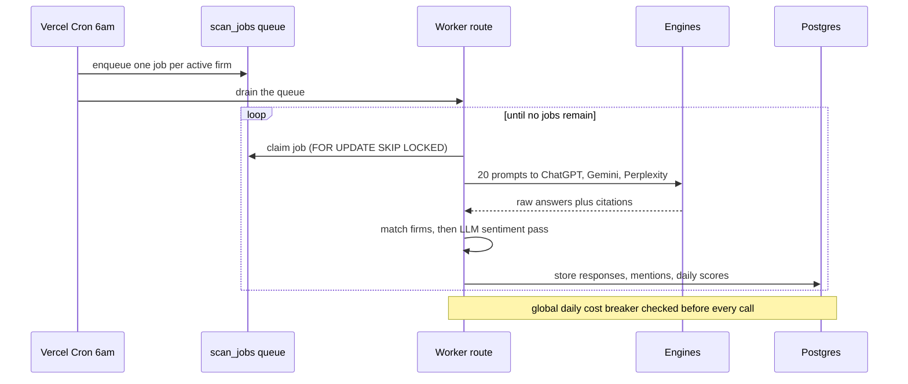
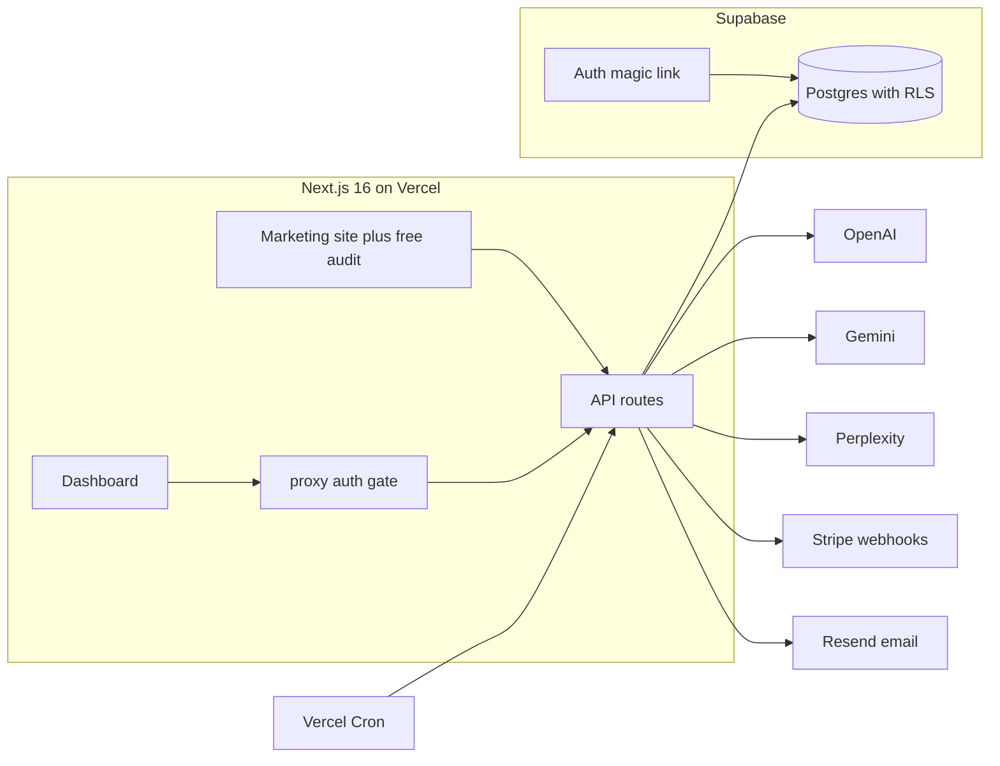

<div align="center">


<h1>First Chair</h1>

**When a prospective client asks ChatGPT, Gemini or Perplexity for a lawyer, does the answer name your firm — or your competitor?**

First Chair puts the exact questions clients ask to the three major answer engines every day, records what they say verbatim, and turns it into an explainable visibility score, competitor share-of-voice, and a prioritized fix list.

[](https://github.com/kandulanikhilvarma/firstchair/actions/workflows/ci.yml)
&nbsp;·&nbsp; Next.js 16 &nbsp;·&nbsp; TypeScript &nbsp;·&nbsp; Supabase &nbsp;·&nbsp; Stripe &nbsp;·&nbsp; 135 unit specs

</div>

---

## Why it exists

Prospective clients increasingly ask AI assistants — not Google — *"who is the best personal injury lawyer in Austin?"* Those answers are given every day, about real firms, and most firms have never read one. This is not rank tracking: an AI answer has no ranked list. A firm is **recommended**, merely **mentioned**, or **invisible** — and the source pages the engine cites are the work order for fixing it.

<table>
<tr>
<td width="33%" valign="top">

### 🔍 Tracks
ChatGPT · Gemini · Perplexity, through official APIs, every day. Raw answers, citations, token counts and cost stored per call.

</td>
<td width="33%" valign="top">

### 📊 Scores
One explainable 0–100 number per engine per day. Every figure on the dashboard opens to the sentence it came from — no black box.

</td>
<td width="33%" valign="top">

### 🛠 Fixes
Rule-based citation-gap analysis: the sources engines trust where a competitor is listed and you are not, ranked by evidence.

</td>
</tr>
</table>

## How the score works

Per engine, per day, across every active prompt `p` (total `N`):

```
score = 100 × Σ w(p) / N        w(p) = 1.0  recommended
                                       0.6  first firm mentioned
                                       0.4  mentioned
                                       0    absent

share of voice = your mentions ÷ mentions of all tracked firms
```

Deliberately simple and auditable — a managing partner can check the arithmetic against the stored answers.

## The daily scan



A failed call is recorded, not fatal; the cost circuit breaker (`MAX_DAILY_LLM_USD`) is the only thing that halts a run. `unique(brand_id, scheduled_for)` makes the queue idempotent — kill the worker mid-run and no firm is double-scanned or double-billed.

## Architecture



| Layer | Choice | Why |
|---|---|---|
| App + API + site | **Next.js 16 App Router, TypeScript, Tailwind v4** | one codebase, one deploy |
| Data + auth | **Supabase** — Postgres, magic-link auth, **RLS on every table** | security by default |
| Job queue | **Postgres table** with `FOR UPDATE SKIP LOCKED` | a correct multi-worker queue in one SQL line — no Redis |
| Billing | **Stripe** | plan state derived only from signature-verified webhooks |
| Email | **Resend** | sign-in links and the weekly report |
| Engines | OpenAI `gpt-4o-mini` · Gemini `2.0-flash` + Search grounding · Perplexity `sonar` | the OpenAI client also speaks any compatible endpoint via `OPENAI_BASE_URL` |

## Design

First Chair is drawn as **the Prism** — one question enters, three engines answer, so the identity is the instrument that splits. Indigo always means your firm; each engine owns a hue for life (ChatGPT emerald, Gemini azure, Perplexity rose) across the mark, charts, badges and email. Archivo for display and numerals, IBM Plex Sans for UI, IBM Plex Mono for verbatim answers. Marketing may express the split; the product stays quiet and dense, with a dark mode as a peer and every colour pair contrast-tested in `src/lib/tokens.test.ts`. The full system is recorded in [`DESIGN.md`](DESIGN.md).

## Project structure

```
src/app/            landing · /login · /dashboard (+ /prompts /competitors /reports) · /onboarding · /billing · /settings · /audit/demo · /privacy · /terms
src/app/api/        /audit · /scan/run · /cron/{scan,weekly} · /stripe/{checkout,webhook,portal} · /auth/callback
src/proxy.ts        Next 16 proxy (middleware) — auth gate, JWT validated per request
src/lib/engines/    OpenAI / Gemini / Perplexity clients — retry, timeout, cost logging
src/lib/scoring/    mention matcher · LLM extraction · score math · aggregation · recommendations
src/lib/scan.ts     scan orchestrator with the cost circuit breaker
src/lib/queue.ts    worker decision + row-mapping logic (DB-free, unit-tested)
src/lib/worker.ts   the live scan-job processor
src/lib/stripe*.ts  Stripe client (server-only) + pure price→plan mapping
supabase/migrations schema, RLS policies, and the scan-job claim function
prompts/            versioned system prompts (scan, extraction)
```

## Getting started

```bash
npm install
cp .env.example .env.local   # fill in keys
npm run dev                  # http://localhost:3000
```

| Script | What |
|---|---|
| `npm run dev` | Dev server |
| `npm run build` | Production build |
| `npm run typecheck` | `tsc --noEmit` |
| `npm run lint` | ESLint |
| `npm test` | Vitest — 135 specs |

Schema and RLS policies live in [`supabase/migrations`](supabase/migrations); apply with `supabase db reset`. LLM prompts are versioned in [`prompts/`](prompts).

## Security posture

- **RLS on every table**, policy shipped in the same migration as the table.
- Engine / Stripe / Supabase service keys are **server-side only**; `.env*` is gitignored.
- Every API input validated with **zod**; **LLM output is untrusted** — schema-validated and rendered as text only.
- Stripe plan state comes **only** from signature-verified webhooks.
- Public audit endpoint is rate-limited and email-gated.

## Status

Pre-launch MVP. All nine planned features (F1–F9) are built and verified end to end.

| Feature | State |
|---|---|
| F1 · Free audit lead magnet | live — landing form runs a real 5-prompt × 3-engine scan and emails the result |
| F2 · Auth, magic link, workspace bootstrap | live — verified against production Supabase |
| F3–F4 · Onboarding → brands, competitors, prompts | live — RLS-enforced, plan-limited |
| F5 · Daily scan worker | live — queue → engines → extraction → scores, verified with real responses |
| F6 · Dashboard on live `daily_scores` | live — trend, share of voice, prompt table, citation gaps, plus Prompts / Competitors / Reports detail pages |
| F7 · Weekly report email | live — Monday cron blends the week and emails |
| F8 · Billing (Stripe checkout, webhook state, portal) | live in test mode — signed-webhook lifecycle verified |
| F9 · Rule-based recommendations | live — citation-gap analysis feeds the dashboard |

Pipeline verification to date has run on an OpenAI-compatible endpoint. Point `OPENAI_API_KEY` at real OpenAI (plus Gemini/Perplexity keys) and re-verify per-brand daily cost against the $0.60 ceiling before onboarding a paying customer. Day-by-day build log: [`docs/LOG.md`](docs/LOG.md).

---

<div align="center">

**Nikhilvarma Kandula**

[LinkedIn](https://www.linkedin.com/in/nikhilvarmakandula) · [Email](mailto:kandulanikhilvarma@gmail.com) · [kandula.studio](https://kandula.studio)

</div>
