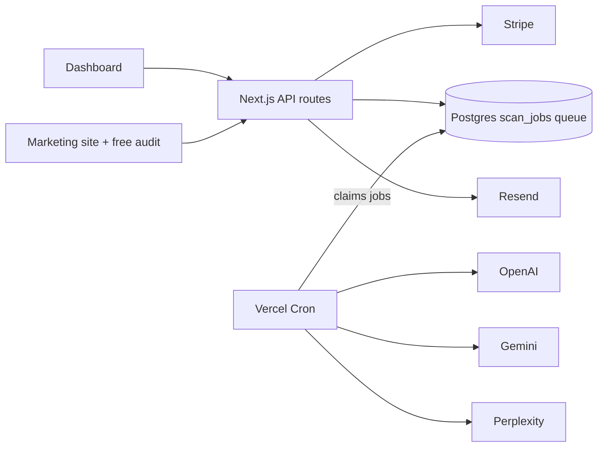

# Rankwell

**AI visibility tracking for law firms.** See how ChatGPT, Gemini and Perplexity talk about your firm — and how to become the one they recommend.

[](https://github.com/kandulanikhilvarma/rankwell/actions/workflows/ci.yml)

Prospective clients increasingly ask AI assistants — not Google — "who is the best personal injury lawyer in Austin?" Rankwell puts those exact questions to the three major answer engines every day, records what they say, and turns the raw responses into an explainable visibility score, competitor share-of-voice, and a prioritized fix list.

## How it works

1. **Prompt set** — 20 templated buyer questions generated per firm (city × practice area), editable.
2. **Daily scan** — every active prompt is sent to OpenAI (`gpt-4o-mini`), Google Gemini (`gemini-2.0-flash` with Search grounding) and Perplexity (`sonar`) through their official APIs. Raw responses, citations, token counts and cost are stored. The OpenAI client also speaks any OpenAI-compatible endpoint (Azure OpenAI, Groq) via `OPENAI_BASE_URL`/`OPENAI_MODEL`.
3. **Mention extraction** — a deterministic alias matcher (case/punctuation-insensitive, `&`↔`and`, legal-suffix tolerant) finds tracked firms; a second zod-validated LLM pass classifies sentiment and recommendation strength. LLM output is treated as untrusted input end to end.
4. **Scoring** — per engine, per day:

   ```
   score = 100 × Σ w(p) / N        w(p) = 1.0 recommended
                                          0.6 first mention among tracked firms
                                          0.4 mentioned
                                          0   absent
   ```

   Share of voice = brand mentions ÷ mentions of all tracked firms. Every dashboard number is traceable to a stored raw response — no black-box scores.
5. **Recommendations** — rule-based citation-gap analysis: domains the engines cite where competitors are listed and you are not, ranked by evidence.

## Architecture



- **Next.js 16 (App Router) + TypeScript + Tailwind v4** — one codebase for marketing site, app and API.
- **Supabase** — Postgres, auth, row-level security on every table.
- **Postgres as job queue** — `FOR UPDATE SKIP LOCKED` with a `unique(brand_id, scheduled_for)` idempotency constraint. No Redis.
- **Cost controls** — per-call cost logging and a global daily circuit breaker (`MAX_DAILY_LLM_USD`) checked before every engine call.
- **Stripe** — plan state derived exclusively from signature-verified webhooks.

## Getting started

```bash
npm install
cp .env.example .env.local   # fill in keys
npm run dev                  # http://localhost:3000
```

| Script | What |
|---|---|
| `npm run dev` | Dev server |
| `npm run build` | Production build |
| `npm run typecheck` | `tsc --noEmit` |
| `npm run lint` | ESLint |
| `npm test` | Vitest unit suite |

Database schema and RLS policies live in [`supabase/migrations`](supabase/migrations); apply with `supabase db reset` against your project. LLM prompts are versioned in [`prompts/`](prompts).

## Project structure

```
src/app/            routes: landing, /login, /dashboard, /onboarding, /billing, /audit/demo
src/app/api/        /api/audit, /api/stripe/{checkout,webhook,portal}, /api/cron/scan
src/proxy.ts        auth gate for app routes (JWT validated per request)
src/lib/engines/    OpenAI / Gemini / Perplexity clients — retry, timeout, cost logging
src/lib/scoring/    mention matcher, LLM extraction, score math, aggregation, recommendations
src/lib/scan.ts     scan orchestrator with cost circuit breaker
src/lib/queue.ts    worker decision/mapping logic (DB-free, unit-tested)
src/lib/stripe*.ts  Stripe client (server-only) + pure price→plan mapping
prompts/            versioned system prompts (scan, extraction)
supabase/           SQL migrations incl. RLS policies + scan-job claim function
scripts/            one-time setup (Stripe products/prices) and dev utilities
```

## Security posture

- RLS enabled on every table, policies shipped in the same migration as the table.
- All engine/Stripe/Supabase service keys are server-side only; `.env*` is gitignored.
- Every API input validated with zod; LLM output schema-validated and rendered as text only.
- Public audit endpoint is rate-limited and email-gated.

## Status

Pre-launch build (30-day MVP plan).

| Area | State |
|---|---|
| Auth (magic link, workspace bootstrap) | live, verified against production Supabase |
| Onboarding → brand/competitors/prompts persistence | live, RLS-enforced |
| Daily scan worker (queue claim → engines → extraction → scores) | live; pipeline verified end-to-end with real LLM responses |
| Billing (Stripe checkout, webhook plan state, portal) | live in test mode; signed-webhook lifecycle verified |
| Dashboard & audit result views | render deterministic demo data — wiring to `daily_scores` is next |
| Weekly email report | not started |

See [`docs/LOG.md`](docs/LOG.md) for the day-by-day build log.
